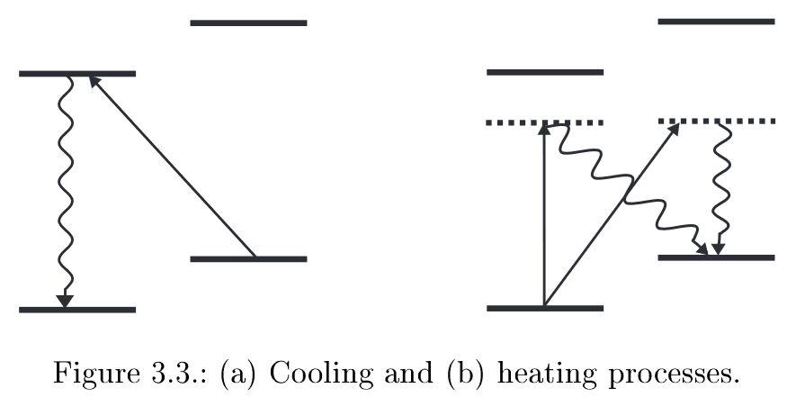

# Controlling the quantum state of trapped ions
## Roadmap:
- Chapters 2 and 3 : basic theoretical foundations. 
    - Chapter 2 : the function of the electrodynamic Paul trap
    - Chapter 3 : Laser-ion interactions
        - Coherent interactions between trapped atoms and lasers
        - Cooling techniques
        - Special case of trapped $\mathrm{Ca}^{+}$ions
- Chapter 4 : experimental setup
- Chapter 5 : Basic experimental techniques required for trapping, exciting, and detecting ions
- Chapter 6 : Main experimental results. 
    - Spectroscopy of the $S_{1 / 2} \leftrightarrow D_{5 / 2}$ quadrupole transition
    - Doppler cooling & sideband cooling 
    - Heating rate measurements
        - show that the ion constitutes a quantum system that is well isolated from its environment. 
    - Simple quantum state manipulation experiments
    - The first steps to extend the experiments to two ions
- Chapter 7 : how to couple a transition between two internal states of an ion to the mode of a high-finesse resonator & an experimental setup that will eventually allow the increase of the spontaneous decay rate of a metastable atomic state. 
----
## Chapter 2 Paul Traps
----
### 2.1 Principle of Operation
----
### 2.2 Single Ion Traps
----
### 2.3 Compensation of Micromotion
----
### 2.4 Ion Crystals
----

## Chapter 3 Laser-ion interactions
----
### 3.1 Basic Interactions
- $H=H_0+H_1$
    - $H_0 =\frac{p^2}{2 m}+\frac{1}{2} m \omega^2 x^2+\frac{1}{2} \hbar \nu \sigma_z$
        - $\nu$ : transition frequency
    - $H_1 =\frac{1}{2} \hbar \Omega\left(\sigma^{+}+\sigma^{-}\right)\left(e^{i\left(k x-\nu_L t+\phi\right)}+e^{-i\left(k x-\nu_L t+\phi\right)}\right)$
        - $\Omega$ : Coupling strength ($\frac{eE_0}{\hbar}$ ?? $\Omega_{rabi}$ ??)
        - k : the wavevector of laser
        - $\nu_L$ : the frequency of laser
        - being imaginary exponential: representing the actual (relative) phase that the atom sees.
    - $H_0$ : the state of the ion
    - $H_1$ : laser-ion interaction
- $\eta=k \sqrt{\frac{\hbar}{2 m \omega}}$ , Rotating-Wave Approximation
    - $H_0 = \hbar \omega\left(a^{\dagger} a+\frac{1}{2}\right)+\frac{1}{2} \hbar \nu \sigma_z$
    - $H_1 = \frac{1}{2} \hbar \Omega\left(e^{i \eta\left(a+a^{\dagger}\right)} \sigma^{+} e^{-i \nu_L t}+e^{-i \eta\left(a+a^{\dagger}\right)} \sigma^{-} e^{i \nu_L t}\right)$
- $H_I=U^{\dagger} H U$ , $U=e^{i H_0 t / \hbar}$
    - $H_I=\frac{1}{2} \hbar \Omega\left(e^{i \eta\left(\hat{a}+\hat{a}^{\dagger}\right)} \sigma^{+} e^{-i \Delta t}+e^{-i \eta\left(\hat{a}+\hat{a}^{\dagger}\right)} \sigma^{-} e^{i \Delta t}\right)$
        - $\hat{a}=ae^{i\omega t}$
        - $\Delta=\nu_L-\nu$
    - Interaction Picture
- Rabi frequency : $\Omega_{n+m, n}:=\Omega\left\langle n+m\left|e^{i \eta\left(\hat{a}+\hat{a}^{\dagger}\right)}\right| n\right\rangle$
    - Atomic Physics : $\Omega=\frac{\left\langle 1\left|e \mathbf{r} \cdot \mathbf{E}_0\right| 2\right\rangle}{\hbar}$
    - How to see them equivalent?
- On resonant, population oscillates between the 2 states at Rabi frequency:
    - $\left(\begin{array}{c}c_n(t) \\ d_{n+m}(t)\end{array}\right)=\left(\begin{array}{cc}\cos \left(\Omega_{n+m, n} t / 2\right) & -i e^{i \frac{\pi}{2}|m|} \sin \left(\Omega_{n+m, n} t / 2\right) \\ -i e^{-i \frac{\pi}{2}|m|} \sin \left(\Omega_{n+m, n} t / 2\right) & \cos \left(\Omega_{n+m, n} t / 2\right)\end{array}\right)\left(\begin{array}{c}c_n(0) \\ d_{n+m}(0)\end{array}\right)$
- Laser detuned $\rarr$ population transfer is no longer complete, but at a higher frequency
    - Pg. 25
- the coupling strength of a laser tuned to m'th sideband, with atom in L-D regime:
    - $L_0^m(x)=1$ : targeted sideband
    - $L_1^m(x)=m+1-x$ : (1st) adjacent sideband
    - $L_{n+1}^m(x)=\frac{1}{n+1}\left((2 n+1+m-x) L_n^m-(n+m) L_{n-1}^m\right)$ for $n>1$ (farther sidebands)
----
#### 3.1.1 L-D Regime
- the atomic wavepacket is confined to a space much smaller than the wavelength of the transition in the Lamb-Dicke regime
    - $\eta^2(2 n+1) \ll 1$
    - $\exp \left(i \eta\left(\hat{a}^{\dagger}+\hat{a}\right)\right)=1+i \eta\left(\hat{a}^{\dagger}+\hat{a}\right)+\mathcal{O}\left(\eta^2\right)$
        - processes that change the vibrational quantum number n by more than one are strongly suppressed
- the Lamb-Dicke regime is **always defined with respect to the wavelength** of the transition involved!
    - If it is mentioned without reference to any particular transition, it is assumed that the Lamb-Dicke criterion holds for all relevant transitions.
- Coupling strength on the carrier : $\Omega_{n, n}=\Omega\left(1-\eta^2 n\right)$
    - $H_I=\frac{1}{2} \hbar \Omega_{n, n}\left(\sigma^{+}+\sigma^{-}\right)$
- Coupling strength on RSB/BSB:
    - $\Omega_{n-1, n}=\eta \sqrt{n} \Omega$ ; $\Omega_{n+1, n}=\eta \sqrt{n+1} \Omega$
    - $H_I=\frac{1}{2} i \hbar \Omega_{n-1, n}\left(\hat{a} \sigma^{+}-\hat{a}^{\dagger} \sigma^{-}\right)$ for RSB ; $H_I=\frac{1}{2} i \hbar \Omega_{n+1, n}\left(\hat{a}^{\dagger} \sigma^{+}-\hat{a} \sigma^{-}\right)$ for BSB
        - These couplings are sometimes referred to as the Jaynes-Cummings and anti-JC Hamiltonian
            - describ es the interaction of a two-level atom with a quantised mo de of the electro-magnetic field. See Chapter 7.
----
#### 3.1.2 Further remarks
- Non-resonant interactions
    - When driving sidebands, carrier may still be driven
        - the resonance frequency of the transition $\ket{S,n}\lrarr\ket{D,n\pm1}$ is changed:
            - $\delta_S=-\frac{\Omega_{n, n}^2}{2 \Delta}, \Delta=\nu_L-\nu$ , if condition $\Delta\gg\Omega_{n,n}$ is not met.
    - Small transfer of p opulation to the non-resonantly coupled levels
        - proportionality factor of leaking: $\sim (\frac{\Omega_{n, n}}{2 \Delta})^2$
- Generalizations of the model
    - 3D potential: $k\cdot r\rarr\vec{k}\cdot\vec{r}$ & $e^{i\eta(a^\dagger+a)}\rarr e^{i \mathbf{k} \cdot \mathbf{r}}=\prod_m e^{\left(i \eta_m\left(a_m^{\dagger}+a_m\right)\right)}$
- N-ion crystal
    - $H_1=\frac{1}{2} \sum_{i=1}^N \hbar \Omega_i \sigma_i^{+} \exp \left(i \sum_m \eta_m^i\left(a_m^{\dagger}+a_m\right)\right) \exp \left(-i\left(\nu_L-\phi_i\right) t\right)+h . c$.
        - i'th ions
        - where $a^\dagger_m$ and $a_m$ are the creation and annihilation operators for the normal modes of oscillation labelled 1...m
        - Go ref[57] for how to obtain (calculate?) $\eta_m^i$
- Experimental realizations of the model
    - the atomic levels should *NOT* couple strongly to other radiation modes of the EM field
        - (other radiation modes??)
            - no spontaneous decay to undesired levels?
            - imperfect laser carrying multiple frequencies somehow?
        - levels should be stable or metastable
            - so use hyperfine or Zeeman ground
            - or use a quadrupole allowed transition, with a metastable and a ground state
                - spontaneous decay rate lowered $\sim (ka_0)^2$ compared to dipole-allowed transition
    - $\Omega$ in $H_1$ : $\Omega=\left|\frac{e E_0}{2 \hbar}\left\langle S, m|(\boldsymbol{\epsilon} \cdot \mathbf{r})(\mathbf{k} \cdot \mathbf{r})| D, m^{\prime}\right\rangle\right|$
        - $E_0$ : electric field amplitude
        - $\mathbf{r}$ : position operator, from COM of atom to valence electron
        - $m, m'$ : magnetic quantum number ($L_z$)
        - $\mathbf{\epsilon}$ : polarization of the laser
        - $\mathbf{k}$ : wave vector of the laser
    - example mechanisms causing decoherence:
        - fluctuations of the laser phase
        - fluctuations of the magnetic field (what's this??)
        - fluctuations of the trap frequency
    - $\Omega$ Rabi frequency must be $\gg$ overall rate of decoherence
        - Typically, $\Omega_{min}\sim 10$ kHz
            - Coupling strength $\Omega \approx \frac{k E_0}{2 \hbar} e a_0^2$
                - $\Omega\sim\Omega_{rabi}$ ??
            - $E_0\approx 4000 V/m$ 
                - $\sim 20\mu W$ laser shining at $(30\mu m)^2$ spot
                - increase by $\eta^{-2}$ if using dipole transition (ex. $\ket{S,0}\lrarr\ket{D,1}$)
----
### 3.2 Laser Cooling
- $\omega \sim \Gamma$ : secular motion vs thermal walk
    - $\omega\ll\Gamma$ : Doppler cooling
        - spacing of sidebands $\ll$ absorption width of the transition ($\Gamma$ due to Doppler effect)
            - ion behaves like a particle seeing a time-dependent Doppler-shifted laser frequency
                - velocity of ion due to potential (secular) changes slower than photon emission/absorption
                    - directly changing the ion's momentum instanteneously, without any other effect
                    - classical cooling
        - cooling the thermal walk
    - $\omega\gg\Gamma$ : sideband cooling
        - J-C model, red sideband $\rarr E_{absorb} < E_{Emit}$ for photons
            - quantized cooling 
            - cooling the secular motion
    - $\Gamma_{micromotion}\ll\Gamma_{laser}$, so micro-motion is not worried about 
----
#### 3.2.1 Doppler cooling
- $F_{Doppler}=\hbar k\Gamma\rho_{ee}$ , Doppler cooling, radiation pressure force
    - $\rho_{ee}$ : excited state probability
        - $\rho_{ee}=\frac{\Omega^2}{\Gamma^2+4(\Delta-kv)^2}$
        - in the limit of low saturation (??)
            - In what case would $I_{sat}$ be low?
    - Linear expansion $\sim v$ velocity: ( $v\approx 0$ )
        - $F=F_0+\left.\frac{d F}{d v}\right|_{v=0} v$
            - $F_0=\hbar k \Gamma \frac{\Omega^2}{\Gamma^2+4 \Delta^2}$
                - radiation pressure force which *displace* the ion *slightly* (against trapping) from the center of the trap.
            - $\left.\frac{d F}{d v}\right|_{v=0}=F_0 \frac{8 k \Delta}{\Gamma^2+4 \Delta^2}$
                - velocity-dependent $\rarr$ viscous drag if $\Delta < 0$
    - $\dot{E}_{c o o l}=\langle F v\rangle=\left\langle\left(F_0+\left.\frac{d F}{d v}\right|_{v=0} v\right) v\right\rangle=\left.\frac{d F}{d v}\right|_{v=0}\left\langle v^2\right\rangle$ : Energy dissipation rate due to cooling
    - Heating rate due to spontaneous emission recoil:
        - $\dot{E}_{\text {heat }}^{e m}=\frac{1}{2 m} \frac{d}{d t}\left\langle p^2\right\rangle=\frac{1}{2 m}(\hbar k)^2 \Gamma\left\langle\rho_{e e}(v)\right\rangle \approx \frac{1}{2 m}(\hbar k)^2 \Gamma \rho_{e e}(v=0)$
            - how to get the first "$=$"?
    - Doppler Limit : $\dot{E}_{\text {cool }}+\dot{E}_{\text {heat }}=\left.0 \Longleftrightarrow \frac{d F}{d v}\right|_{v=0}\left\langle v^2\right\rangle=\frac{1}{m}(\hbar k)^2 \Gamma \rho_{\text {ee }}(v=0)$
    - Doppler temperature: $k_B T=\frac{\hbar \Gamma}{4}\left(\frac{\Gamma}{-2 \Delta}+\frac{-2 \Delta}{\Gamma}\right)$
        - $k_B T_{\min }=\frac{\hbar \Gamma}{2}=: \frac{\hbar \Gamma}{4}(1+\alpha) $ with $ \alpha=1$ and with detuning $\Delta=-\Gamma/2$
            - Assumed photon from spontaneous decay in the direction of laser
                - $\alpha=1/3$ for isotropically emission
                    - because recoil diffusion spread in 3 directions instead of 1.
                        - the "1" has not been understood yet, but take it as true... (??)
                    - atomic transition in dipole radiation pattern : $\alpha = 2/5$
            - Continuously adjusting $\Delta$ during Doppler cooling?
    - sidestory: 
        - many similarities to Brownian motion
        - the above simple case: Ornstein-Uhlenbeck process
            - random walk in momentum space 
                - with a linear drift, and
                - with a constant diffusion coefficient
        - In the stationary state, momentum distribution has a Gaussian shape, so that a thermal distribution results for the energy level occupation
----
#### 3.2.2 Sideband cooling
- cooling rate: $R_n=\Gamma \frac{(\eta \sqrt{n} \Omega)^2}{2(\eta \sqrt{n} \Omega)^2+\Gamma^2}$
    - product of the decay rate of the excited level and its occupation probability
- The lifetime of the upp er level maybe artificially shortened by coupling it to an auxiliary level that has a higher decay rate.

- heating due to non-resonant excitation 
    - prevent $\ket{n=0}$ from being dark
    - thus a minimum energy limit
    - Raman transition??

----
### 3.3 Quantum State Manipulation and Analysis       
----
#### 3.3.1 Electron Shelving
- Electron shelving
    - discriminate between two internal states with efficiency $\sim 1$
    - Example: weak $\ket{S}\lrarr\ket{D}$ , strong $\ket{S}\lrarr\ket{P}$ , using $\ket{S}\lrarr\ket{D}$ ($\ket{D}$ metastable)
        - driving $\ket{S}\lrarr\ket{P}$ with a laser
            - if in $\ket{D}$, no fluorescence
            - if in $\ket{S}$ , $\ket{S}\lrarr\ket{P}$ emits photons
            - repeat state preparation (??) and fluorescence detection to determine state occupation
                - error rate $\sim 0.1\%$
        - only gets coefficients, not phase??

----
#### 3.3.2 Manipulation of the ion's quantum state
- ($\frac{\pi}{2}$ pulse: along which axis?? should be Y:$\ket{0}\rarr\ket{+}$? does not matter if $\pi$ or $2\pi$ )
----
#### 3.3.3 Quantum State Analysis
- Determination of the distribution of motional states
    - detects the actual occupations of motional states
    - Didn't quite get it
    - "the signal", which signal?
- Temperature measurements:
    - detects the mean occupation number of motional states (effective temperature)
    - 3 Methods *if in L-D regime*
        - Method 1:
            - incoherently exciting and saturating red sideband, measure population on $\ket{D}$
                - $\pi$ pulse??
                - what's incoherently??
                - why saturating??
            - incoherently exciting and saturating blue sideband, measure population on $\ket{D}$
            - population on ground: $p_0=1-\frac{p(\Delta=-\omega)}{p(\Delta=+\omega)}$
                - rsb: population not on ground ; bsb: total population (1??)
            - assuming a substantial population on motional ground state
                - rsb excitation small
        - Method 2:
            - incoherently excited without saturating the carrier
                - what about sideband?? incoherently exciting and saturating red sideband??
            - $\frac{p(\Delta=-\omega)}{p(\Delta=0)}=\sum_n p_n \frac{(\eta \sqrt{n} \Omega)^2}{\Omega^2}=\eta^2 \bar{n}$
                - get $\eta$ in advance:
                    - directly calculated
                    - determined experimentally by measuring the Rabi frequencies on the carrier and the first sideband.
                        - J-C model, $\eta$ before sideband strength
        - Method 3:
            - Coherent excitation of the carrier with a pulse of length
            - $p_D(t)=\frac{1}{2}\left\{1-\sum_n \rho_{n, n} \cos \left(\Omega\left(1-\eta^2 n\right) t\right)\right\} \approx \frac{1}{2}\left\{1-\frac{\cos (2 \Omega t)+2 \Omega t \eta^2(\bar{n}+1) \sin (2 \Omega t)}{1+\left(2 \Omega t \eta^2(\bar{n}+1)\right)^2}\right\}$
                - Dampted Rabi Oscillation
                    - Forgot why dampted... Decoherence??
            - The loss of contrast is related to the mean vibrational quantum number
                - but why??
        - last two methods are useful for checking whether the theoretical cooling limit is approached after Doppler cooling
        
            

----
### 3.4 Sideband Cooling and Quantum State Manipulation of $\textrm{Ca}^+$ Ions
----
#### 3.4.1 Level Scheme of $\textrm{Ca}^+$ Ions
----
#### 3.4.2 Cooling Techniques
----
#### 3.4.3 Coherent Manipulations: Geometrical Considerations
----
#### 3.4.4 Pulsed Spectroscopy on the $S_{1/2}\lrarr D_{5/2}$ transition
----

----
## Chapter 4 Experimental Setup
----
### 4.1 Ion Trap Apparatus
----
#### 4.1.1 Trap Deisng
----
#### 4.1.2 Radio-Frequency Drive
----
#### 4.1.3 Vacuum Vessel
----
#### 4.1.4 Fluorescence Detection
----
#### 4.1.5 Computer Control
----
#### 4.1.6 Laser Beams
----
### 4.2 Lasers
----
#### 4.2.1 Frequency Doubled Ti: Sapphire Laser for 397 nm
----
#### 4.2.2 Ultra Stable Ti: Sapphire Laser for 729 nm
----
#### 4.2.3 Diode Lasers at 854 and 866 nm
----
#### 4.2.4 Wavelength Measurements
----
## Chapter 5 Ion Storage
----
### 5.1 How to Trap Single Ions
----
### 5.2 Electronic Excitation of the Secular Motion
----
### 5.3 Compensation of Micromotions
----
#### 5.3.1 Coarse Compensation
----
#### 5.3.2 Correlation Measurements
----
#### 5.3.3Resolved Sideband Measurements
----
### 5.4 Excitation Spectra
----
#### 5.4.1 $S_{1/2}\lrarr P_{1/2}$ Cooling Transition
----
#### 5.4.2 $D_{3/2}\lrarr P_{1/2}$ Transition
----
#### 5.4.3 $D_{5/2}\lrarr P_{3/2}$ Transition
----
### 5.5 Optimization of the Laser Parameters and the Magnetic field
----
## Chapter 6
----
### 6.1 Spectroscopy on the $S_{1/2}\lrarr D_{5/2}$ Transition
----
#### 6.1.1 Spectrum of a Single Ion
----
#### 6.1.2 Ramsey Resonance Experiments
----
#### 6.1.3 Two-Ion Spectra
----
#### 6.1.4 AC-Stark Shifts
----
### 6.2 Coherent Dynamics after Doppler Cooling
----
### 6.3 Temperature Measurements after Doppler Cooling
----
### 6.4 Sideband Cooling Experiments
----
#### 6.4.1 Sideband Cooling Results
----
#### 6.4.2 Cooling Dynamics
----
#### 6.4.3 Heating Rate Measurements
----
#### 6.4.4 Sideband Cooling of Two Ions
----
### 6.5 Coherent Dynamics after Sideband Cooling
----
#### 6.5.1 Rabi Oscillations
----
#### 6.5.2 Non-Resonant Excitations
----
#### 6.5.3 Generation of Fock States
----
#### 6.5.4 Two-Ion Results
----
### 6.6 Coherence-Limiting Processes
----
### 6.7 Improvements of the Experimental Setup
----

----
## Chapter 7
----
