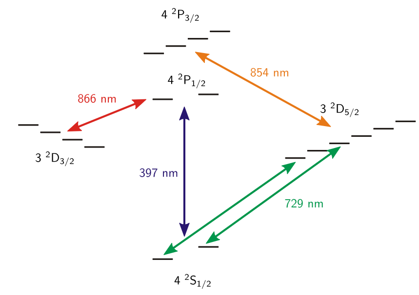

<!---->
# Sideband Cooling of Atomic and Molecular Ions

### Abstract

## General Physics of Trapped Ions
#### 1. Introduction
- Doppler cooling relies on continuous scattering of photons.
- Most molecular ions remain unsuitable for laser cooling, due to decays to different rovibrational levels.
- use the common motion of the ions to transfer quantum information
- quantum logic can be used to determine the internal state of a *spectroscopy* ion using an *auxiliary* ion.
    - only the *auxiliary* ion is required to provide a closed level scheme (no population leaking?) for cooling and state detection.
    - spectroscopy ion provides a good clock transition, co-trapped auxiliary ion bears the measurements.
- (??) requires cooling to the motional ground state.
----
----
### 2. Trapped Ions
----
#### 2.1 Linear Paul Trap
----
##### 2.1.2 Pseudo-potential Model
- $\omega_n=(2n+\beta)\Omega/2$ is the ion's oscillation frequency.
    - at $\beta \ll 1$, fundamental freq $\sim 0 \rarr$ fundamental: secular, higher-order: micromotion. (?)
- Equations of secular and micro-motion:
    - Secular: $\frac{d^2R_i}{dt^2}=-\omega_i^2R_i$
    - Micro-: $\delta_i=-\frac{q_iR_i}{2}cos(2\xi)$
- Expressions of secular and micro-motion: (in $\textrm{i}^\textrm{th}$ direction)
    - Secular : $r_{i,s}=r_i^0cos(\omega_it+\phi_i)$
    - Micro- : $r_{i,\mu}=-r_i^0cos(\omega_it+\phi_i)\cdot\frac{q_i}{2}cos(\Omega t)$
    - Overall: $r_i=r_{i,s}+r_{i,\mu}$
    - $r_i^0$ and $\phi_i$ are determined by initial condition.
- Secular frequency: $\omega_i=\frac{\Omega}{2}\sqrt{\frac{q^2_i}{2}+a_i}=\frac{\Omega}{2}\beta_i$
- Harmonic pseudo-potential: ($q_i$ small, $r_{i,\mu}$ neglected)
    - $\Psi_i=\frac{1}{2}m\omega_i^2r_i^2$
        - Example: (Ca: 40 amu, 2.7 mm to electrodes, radial freq $\omega_r=2\pi\cdot1$ Mhz)
            - $\Psi=0.5*6.64*10^{-26}*(2.7*10^{-3})^2*(2pi*10^6)^2*6.24×10^{18}=60$ eV
- Stray electric charge: shift of 0-potential point, ion exhibits additional micro-motion
    - $r_{i,e}=r_i^e(1-\frac{q_i}{2}cos(\Omega t))$ , parallel to secular motion
        - $r_i^e$ : stationary shift of 0-potential point
- Phase or amplitude differences of the RF-potentials can cause excess micro-motion as well.

----
----
#### 2.2 Quantum Mechanics of the Ion Motion
- Compensation to position operator : (substitutive with pseudo-potential)
    - $\hat{r}=\sqrt{\frac{\hbar}{2m\omega}}(\hat{a}u^*(t)+\hat{a}^\dagger u(t))$
        - $u(t)=e^{i\beta\Omega/2}\sum_{n=-\infty}^{\infty}C_{2n}e^{in\Omega t}$
    - use when pseudo-potential not applicable due to failure of the compensation to micro-motion
----
#### 2.3 Motion of 2 Co-Trapped Ion
- Axial normal modes of motion : ($\sim \omega_z$ in single-ion cases)
    - $\omega_\pm=\omega_z\sqrt{1+\frac{1}{\mu}\pm\sqrt{1-\frac{1}{\mu}+\frac{1}{\mu^2}}}$
        - $\mu=\frac{m_2}{m_1}$: reduced mass
        - $\omega_-$ resembles center of mass mode
    
----

----
### 3. Atom-Light Interactions
----
#### 3.1 Free 2-Level Atom
- $H_a=\hbar\omega_g\ket{g}\bra{g}+\hbar\omega_e\ket{e}\bra{e}$
    - $\ket{g}\sim\hbar\omega_g$ , $\ket{e}\sim\hbar\omega_e$ , $\omega_0=\omega_e-\omega_g$
##### 3.1.1 Interaction with light
- $H_i=\frac{\hbar}{2}\Omega(\ket{g}\bra{e}e^{-i(\vec{k}\cdot\vec{x}-\omega_lt+\phi)}+\ket{e}\bra{g}e^{i(\vec{k}\cdot\vec{x}-\omega_lt+\phi)})$
    - $\vec{k}$ : wave vector ; 
    - $\vec{x}$ : position of atom ;
    - $\omega_l$ : angular freq of light ; 
    - $\phi$ : relavant phase shift ; 
    - $\Omega$ : Rabi-freq.
        - $\Omega=\frac{2}{\hbar}e\bra{g}\vec{E_0}\cdot\vec{x}\ket{e}$
            - $\vec{E_0}$ contains polarization direction. Measured at $\vec{x}$.
    - Dipole and rotating wave approximation are applied.
        - Dipole approximation: $e^{i\vec{k}\cdot\vec{x}}$ , negelecting the spatial phase change of wave over the atom ($\lambda\gg a_0$).
        - rotating wave approximation: terms $\sim(\omega_l+\omega_a)\sim2\omega_l\rarr0$ , in which $\omega_l$ is laser freq. $\rarr$ terms $\sim\Delta=(\omega_l-\omega_a)$ is preserved. Same as in C.J.Foot.
- Probability at states: (assuming atom at rest ;  not at rest: Doppler shift)
    - $|c_g(t)|^2=cos^2(\frac{\chi t}{2})+\frac{\Delta^2}{\chi^2}sin^2(\frac{\chi t}{2})$
    - $|c_e(t)|^2=\frac{|\Omega|^2}{\chi^2}sin^2(\frac{\chi t}{2})$
        - $\chi=\sqrt{|\Omega^2|+\Delta^2}$ : off-resonant Rabi-freq
            - now population oscillate at this freq, not $\Omega$
        - $\Delta=\omega_l-\omega_a$ : detuning (laser from atom, $\omega_a\equiv\omega_0$)
        - Example: $\pi$ - pulse in perfect transition ($\Delta$=0) $\sim$ perfect oscillation
            - rotation angle: transferred population
                -  $\Theta(t)=\int_{-\infty}^t|\Omega(t')|dt'$ (still assuming $\Delta=0$)
            - $t\Omega=\pi$ , $|c_e(t)|^2=1\cdot sin^2(\frac{\pi}{2})=1$ , population perfectly inverted.
    - $\Omega(t)=\Omega$ is assumed, but not true for real laser.
        - true only if linear polarization
            - direction of polarization: $\hat{\vec{E_0}}$
            - direction of propagation: $\hat{\vec{k}}$ 
##### 3.1.2 Spontaneous Emission
- density matrix: [$\rho_{ij}=c_ic_j^*$] , $i,j\in\{e,g\}$
- damped Rabi-oscillation $\rarr$ steady state at $t\gg\tau=1/\Gamma$
    - steady state population $\rho_{ee}=\frac{|\Omega|^2}{4\Delta^2+2|\Omega|^2+\Gamma^2}=\frac{1}{2}\frac{s}{s+1}$
        - $s=\frac{2|\Omega|^2}{4\Delta^2+\Gamma^2}$
            - $s_0=s(\Delta=0)=\frac{I}{I_{sat}}$
            - ($\Delta=0$ and $I=I_{sat}$) provide maximum $\rho_{ee}=1/4$ 
                - maximum population at $\ket{e}$ when spontaneous emission is considered
- Doppler shift correction: $\Delta'=\Delta+\vec{k}\cdot\vec{v}$
    - substitute in when atom is not at rest.
----
#### 3.2 Interaction With a Trapped Ion
- $\ket{g,n}$ represents atomic states *if no entanglement between $\ket{g} , \ket{n}$*
- motion $\rarr$ sidebands
    - $\omega_l=\omega_a\pm\omega_z$
    - attribute of ion spectrum, not laser!
- $H_i=\frac{\hbar}{2}\Omega(\ket{g}\bra{e}e^{-i(\eta[\hat{a}u^*(t)+\hat{a}^\dagger u(t)]-\Delta t+\phi)}+\ket{e}\bra{g}e^{+i(\eta[\hat{a}u^*(t)+\hat{a}^\dagger u(t)]-\Delta t+\phi)})$
    - resemble the $H_i$ in 3.1.1
    - $h_{eg}=h_{ge}$ still holds: symmetry between $1\rarr2$ and $2\rarr1$
- **Lamb-Dicke parameter** $\boldsymbol{\eta}$ :$=\vec{k}\cdot\vec{x}_0=\vec{k}\cdot\hat{x}\sqrt{\frac{\hbar}{2m\omega_z}}$
    - the ability of excitation and emission events to change the motional mode of the ion
    - $\eta=\sqrt{E_{rec}/\hbar\omega_z}$
        - ratio between the recoil energy (of the ion due to photon emission) and the energy separation of the motional states
- Lamb-Dicke approximation: $\eta\sim0$ , expansion about $\eta$ 
    - $e^{-i(\eta[\hat{a}u^*(t)+\hat{a}^\dagger u(t)]-\Delta t+\phi)}\approx e^{i(\Delta t-\phi)}\cdot\sum_{m=0}^\infty\frac{1}{m!}\cdot(i\eta)^m\cdot(\hat{a}^\dagger e^{i\beta\Omega_{\textrm{rf}}t/2}\cdot\sum_{n=-\infty}^\infty C_{2n}e^{in\Omega_{\textrm{rf}}t}+\textrm{h.c.})^m$
    - $..\approx..$ at $\Delta\approx(m\beta+n)\Omega_{\textrm{rf}}$
        - RWA again
        - called "tuning to the $n^{\textrm{th}}$ micro-motional- and $m^{\textrm{th}}$ secular sideband"
- No RF-sideband assumption: ($e^{in\Omega_{\textrm{rf}}t}\sim0$ if $n\neq0$ , another RWA)
    - $H_i\simeq\frac{\hbar}{2}\Omega_0(\ket{e}\bra{g}\cdot C_0\cdot e^{i(-\Delta t+\phi)}\cdot\sum_{m=0}^\infty\frac{1}{m!}\cdot(i\eta)^m\cdot(\hat{a}^\dagger e^{i\omega_zt/2}+\hat{a} e^{-i\omega_zt/2})^m+\textrm{h.c.})$
        - $\Omega_0=\Omega\cdot C_0=\Omega/(1+q/2)$
        - $\omega_z=\beta\Omega_{\textrm{rf}}/2$ is applied.
        - (Assuming $\omega_0\equiv\omega_z$)
            - why??
    - notice that $H_i \sim k\cdot \hat{a}+l\cdot\hat{a}^\dagger$
- couple manifold $\ket{g,n} \lrarr \ket{e,n+s}$
    - connection strength: $\bra{g,n}H_i\ket{e,n+s}=\frac{\hbar}{2}\Omega_0 e^{i(\phi-\omega_l t)}\bra{n}e^{i(\vec{k}\cdot\vec{x})}\ket{n+s}$
        - effective Rabi-freq: $\Omega_{n,n+s}=\Omega_0\bra{n}e^{i(\vec{k}\cdot\vec{x})}\ket{n+s}=\Omega_0\bra{n}e^{i\eta(\hat{a}+\hat{a}^\dagger)}\ket{n+s}=\Omega_0e^{-\eta/2}\eta^{|s|}\sqrt{\frac{n_<!}{n>!}}L_{n<}^{|s|}(\eta^2)$
            - $n_<$ is the lesser of n and n+s
            - $L^{\alpha}_n(X)$ is the generalized Languerre Polynomial
        - this expression represents conservation of momentum
            - the change in Rabi freq comes from the wave-function overlap of the states in momentum space, separated by the photon momentum $\hbar k$
    - by setting $\Delta\approx s\omega_z$ , with $s=k-l$
    - $s > 0$ : blue sideband ; $s < 0$ : red sideband ; $s = 0$ : carrier
    - BUT I remember only s=1 works?? solved: in LD regime
##### 3.2.1 Lamb-Dicke Regime
- $\bra{n}r^2\ket{n}\ll1/k$ , or $\eta\sqrt{2n+1}\ll1$
    - the spread of the motional wave function is much less than the wavelength of the light.
- $H_{LD}=\frac{\hbar}{2}\Omega_0\ket{e}\bra{g}(1+i\eta(\hat{a}e^{-i\omega_zt}+\hat{a}^\dagger e^{i\omega_zt}))e^{i(\phi-\Delta t)}+\textrm{h.c.}$
    - only 3 resonances: $1, \hat{a}, \hat{a}^\dagger$
        - they are operators on *motional states*
    - $\Delta=0$ : carrier, $H_{car}=\frac{\hbar}{2}\Omega_0(\ket{e}\bra{g}+\ket{g}\bra{e})$
        - $\ket{g,n}\lrarr\ket{e,n}$
        - $\Omega=\Omega_0$
    - $\Delta=-\omega_z$ : red sideband, $H_{rsb}=\frac{\hbar}{2}\Omega_0\eta(\hat{a}\ket{e}\bra{g}+\hat{a}^\dagger\ket{g}\bra{e})$
        - $\ket{g,n}\lrarr\ket{e,n-1}$
        - $\Omega=\Omega_0\eta\sqrt{n}$
    - $\Delta=\omega_z$ : blue sideband, $H_{bsb}=\frac{\hbar}{2}\Omega_0\eta(\hat{a}^\dagger\ket{e}\bra{g}+\hat{a}\ket{g}\bra{e})$
        - $\ket{g,n}\lrarr\ket{e,n+1}$
        - $\Omega=\Omega_0\eta\sqrt{n+1}$
----
#### 3.3 Secular Motion as a State Mediator
- Example of mapping information from spectropy atom onto auxiliary atom
    - $\psi_1=(\alpha\ket{g}_s+\beta\ket{e}_s)\ket{g}_a\ket{0}_m$ : initial state
    - $\psi_2=(\alpha\ket{g}_s\ket{0}_m+\beta\ket{g}_s\ket{1}_m)\ket{g}_a$ : a $\pi$ pulse on red sideband of the *spectropy* ion
    - $\psi_3=\ket{g}_s(\alpha\ket{g}_a+\beta\ket{e}_a)\ket{0}_m$ : a $pi$ pulse on red sideband of the *auxiliary* ion
- Sympathetic Recoil Spectroscopy
    - cool S and A ion to full ground state (ground state disappear) ; if S ion scatters A photon on the blue sideband (but different freq, cuz A needs energy to move as well?), A ion opens rsb as well. 
        - no more knowledge provided; only high detection efficiency with high precision.
----
**decay rate $\frac{1}{\tau} = \Gamma$ line width**, related to Fourier transformation  
- $\Psi_f(\vec{r}, t)=\Psi_f(\vec{r}, 0) \exp \left(-i E_f(t / \hbar)-t / \tau\right) = (\textrm{Fourier}) \int \frac{\hbar / \tau}{\left(E_f-E\right)^2+(\hbar / \tau)^2} e^{-i E_f(t / \hbar)} dE$  
- Writing $\hat{U}(t)=e^{i\hat{H}t/\hbar}$ for $\Psi_f(\vec{r}, t)=\hat{U}(t)\Psi_f(\vec{r}, 0)$ gives $H=-\frac{i\hbar}{\tau}$ corresponding to imaginary energy that broadens the lorentzian lineshape (but why? Any profound insights available?)
- $\Gamma$ , in the context, refer to ion's linewidth, not laser.
----
### 4. Cooling of Trapped Ions
- Two regimes of interest:
    - $\omega_z\ll\Gamma$ : Doppler cooling
        - timescale on which the velocity of the ion changes is smaller than the time it emit and absorb photons.
            - velocity dependent radiation pressure.
        - the ion acts as a free particle with a time-modulated Doppler shift of the cooling light.
    - $\omega_z\ll\Gamma$ : sideband cooling
        - distinct sidebands appear
        - sidebands $\sim$ ion's harmonic motion 
        - the laser is tuned so the energy of the absorbed photon is less than the energy of spontaneously emitted photons
            - red sideband $\sim \ket{g,n}\rarr\ket{e,n-1}$
----
#### 4.1 Doppler Cooling
- $\lang\Delta E_{kin}\rang=\hbar\vec{v}\cdot\vec{k}_l+\frac{\hbar^2k^2}{2m}(1+\kappa)$ , the average change in kinetic energy per scattering event in the direction of the beam
- steady state (limit) of Doppler cooling
    - $E_{kin}=\frac{1}{2}m\lang v^2\rang _v=\frac{\hbar(\Gamma^2+4\Delta^2)}{32\Delta}(1+\kappa)$
    - $E_{kin,min}=\frac{\hbar\Gamma}{8}(1+\kappa)$ at $\Delta=\Gamma/2$
        - $k_BT_D=\frac{\hbar\Gamma}{4}(1+\kappa)$ gives Doppler temperature $T_D$
- $\kappa$ measures isotropy:
    - $\kappa=1/3$ : isotropic emission & single laser
    - $\kappa=1$ : isotropic emission & isotropic laser
    - $\kappa=??$ : isotropic emission & single laser perpendicular to quantization axis
        - ion is cooled to a lower state in the chosen direction but heated in the other two directions
    - the ion can simultaneously be cooled in *all 3 directions* with *a single laser*, by choosing the angle of the laser, so that $\vec{k}_l$ has a finite overlap with all the principle axes.
        - the ion trap defines a quantization axis
        - easiest choice: $45^\circ$ with respect to all 3 axes $\rarr k_BT_D=\hbar\Gamma/2$ , the normal value.
        - however, this requires all the motional frequencies ($\Omega_x, \Omega_y,\Omega_z$) are different (on a timescale set by the cooling time)
----
#### 4.2 Sideband Cooling
- $\ket{g,n}\rarr\ket{e,n-1}\rarr\ket{g,n-1}\rarr...\rarr\ket{g,1}\rarr\ket{e,0}\rarr\ket{g,0}$
    - Red-detuned laser excites ion's internal state and reduce its motional state. 
    - In the Lamb-Dicke limit, decay from the excited state primarily happen on the carrier.
- Rate Equation Model
    - $R_n=\Gamma\rho_{ee}=\Gamma\frac{|\Gamma|^2/4}{\delta^2+|\Omega|^2/2+\Gamma^2/4}=\Gamma\frac{(\Omega\eta\sqrt{n})^2}{2(\Omega\eta\sqrt{n})^2+\Gamma^2}$
- Heating process
    - in reality, non-resonant excitation prevents the ground state from being a perfect 'dark state'
    - Process 1: excitation on the carrier and re-emission on the red sideband
        - $R_1=p_0\frac{\Omega^2/4}{\omega_z^2}\Gamma\tilde{\eta}^2$
    - Process 2: excitation on the blue sideband and re-emission on the carrier
        - $R_2=p_0\frac{\eta^2\Omega^2/4}{2\omega_z^2}\Gamma$
    - $p_0$ population in $n=0$
    - $\boldsymbol{\tilde{\eta}}\neq\boldsymbol{\eta}$ !!!
        - $\boldsymbol{\tilde{\eta}}$ for spontaneous decay
        - $\boldsymbol{\eta}$ for absorption
        - because the emission process is not limited to the same direction as the absorption process
        - in a 3-level cooling scheme, the emission wavelength can further be different from the absorption wavelength
- $\lang n\rang=n_{ss}+(n_0-n_{ss})e^{-Wt}$ , assuming 2-level atom
    - $n_0$ mean quantum number
    - $W=\frac{\Gamma\eta^2\Omega^2}{2\eta^2\Omega^2+\Gamma}$ : cooling rate
    - $n_ss$ : steady state quantum number
        - $n_ss\approx\frac{\Gamma^2}{4\omega_z^2}(\frac{\tilde{\eta}^2}{\eta^2}+\frac{1}{4})$ , at $\eta\Omega\ll\Gamma$
        - $\lang n\rang\approx0$ at $\omega_z\gg\Gamma$
            - sideband region
            - off-resonant scattering becomes negligible, and the ion can be cooled to the ground state with high probability.
- With no external heating mechanisms, only off-resonant excitation on unwanted sidebands can keep the ion from being cooled to the ground state.

----
#### 4.3 Determination of the Motional State
- to compare the strength of red sideband and blue sideband
    - at ground, red sideband $\rarr$ 0 strength
##### 4.3.1 Excitation on the Red Sideband
- $P_n=\frac{\langle n\rangle^n}{(\langle n\rangle+1)^{n+1}}$ gives the (Maxwell-Boltzmann) probability distribution of the particle's motional (Fock) state.
    - $\lang n\rang$ is the weighted ($P_n\cdot n$) average
- $\rho_{\mathrm{RSB}}=\sum_{n=1}^{\infty} \frac{\langle n\rangle^n}{(\langle n\rangle+1)^{n+1}} \sin ^2\left(\Omega_{n, n-1} t / 2\right)$ gives the probability of ion resonant with the *Red* sideband laser
- $\rho_{\mathrm{BSB}}=\sum_{n=0}^{\infty} \frac{\langle n\rangle^n}{(\langle n\rangle+1)^{n+1}} \sin ^2\left(\Omega_{n, n-1} t / 2\right)$ gives the probability of ion resonant with the *Blue* sideband laser
- $\lang n\rang=\frac{\rho_{\mathrm{RSB}}}{\rho_{\mathrm{BSB}}-\rho_{\mathrm{RSB}}}$ as result.
##### 4.3.2 Rabi Oscillations on Motion-Sensitive Transitions
- in L-D regime, $\Omega_{n,n+s}\sim\ket{n}$
    - $\Omega_{n,n+s}$ : coupling strength between motional $\ket{n} \lrarr\ket{n+s}$
    - $\rho_{e e}(t)=\frac{1}{2}\left(1-\sum_{n=0}^{\infty}\left|c_n\right|^2 \cos \left(\Omega_{n, n} t / 2\right)\right)$
        - the oscillation appear damped due to interference between the different frequencies $\Omega_{n,n}$
- band choice $\sim$ region of interest
    - low excitation: blue sideband
        - higher slope (more reachable states??)
    - high excitation: carrier
        - 1st sideband is almost constant at high excitations
        - population spread across many states
- dephasing method $\rarr$ (potentially) determine occupation of the individual motional states ($|c_n|^2$) by Fourier transforming the signal (??)
##### 4.3.3 Sideband Strength Comparison
- Outside the L-D limit, higher order sidebands starts to appear, so a full thermal Maxwell-Boltzmann distribution is required:
    - $P_n=\frac{e^{-\left(n+\frac{1}{2}\right) \hbar \omega / k_B T}}{Z(T)}$
- expected average excitation on the $s^{th}$ sideband (for a pulse with length $t$)
    - $\rho_{e e}=\sum_{n=0}^{\infty} P_n \sin ^2\left(\Omega_{n, n+s} t / 2\right)$
- different Rabi frequencies between the different motional levels $\rarr$ unique combination of *sideband excitation depending on the motional temperature*

----
----
### 5. Manipulating the $^{40}\textrm{Ca}^+$ ion
----
#### 5.1 Doppler Cooling
- $\lang n\rang\sim10^7$ for ions just trapped. Need fast scattering.
- $\textrm{S}_{1/2}\lrarr \textrm{P}_{1/2}$ , the dipole allowed transition, provide decay rate of $2\pi\cdot20.7$ MHz
- Population leakage: $\textrm{P}_{1/2}\rarr\textrm{D}_{3/2}$ is open, but $\textrm{D}_{3/2}$ is stable (1Hz).
    - *repumping* on $\textrm{P}_{1/2}\lrarr\textrm{D}_{3/2}$
    - heating by repumping is negligible:
        - $\textrm{P}_{1/2}\rarr\textrm{D}_{3/2}$ 1 out of 12 cycles
        - repumping at infrared, cooling at blue
- $T_D=0.5$ mK, corresponding to $\lang n\rang\sim20\gg1$ for $\omega_z=2\pi\cdot500$ kHz.
   
----
#### 5.2 Sideband Cooling
- $\mathrm{S}_{1 / 2} \leftrightarrow \mathrm{D}_{3 / 2}$ or $\mathrm{S}_{1 / 2} \leftrightarrow \mathrm{D}_{5 / 2}$ quadrupole transitions
    -  natural lifetimes of 1 s.
- $\mathrm{S}_{1 / 2} \leftrightarrow \mathrm{D}_{5 / 2}$ in addition provides the ability to easily discriminate between the two states
- Long lifetime of $\mathrm{D}_{5 / 2}\rarr$ coupling to an auxiliary level (e.g. $\mathrm{D}_{5 / 2} \leftrightarrow \mathrm{P}_{3 / 2}$), but cannot drive strongly, by which the sideband resolution is compromised.
- scheme: use a low power / interleaved pulse with excitation on  $\mathrm{S}_{1 / 2} \leftrightarrow \mathrm{D}_{5 / 2}$ , and subsequent repumping to $\mathrm{S}_{1 / 2}$ via $\mathrm{P}_{3 / 2}$

----
#### 5.3 Detecting the Internal State
- scattering at saturation 
- *electron shelving* $\sim$ fluorescence
    - to 'shelve' the electron in a state in which it does NOT fluoresce 
        - e.g. shelve to the metastable $\mathrm{D}_{5 / 2}$ in $^{40}\textrm{Ca}^+$. Then driving $\textrm{S}_{1/2}\lrarr \textrm{P}_{1/2}$ makes ion fluoresce if at ground but not if shelved to the metastable state.
            - long lifetime of metastable states produces high fidelity.
- On the narrow transition, to selectively transfer the ion depending on the motional state is possible, and motional state can be mapped onto the internal state.
    -  I've learned this?? 
    
## Experiments with Trapped Ions
----
### 11 Experimental Equipment and Methods
----
#### 11.1 Confinement of Ions
----
##### 11.1.1 The Linear Paul Trap
----
##### 11.1.2 Vacuum System
##### 11.1.3 Generation of Ions
- single calcium atoms are obtained from metallic calcium placed in a heated oven at $T\simeq 400C^\circ \sim 500C^\circ$
    - constant atomic beam through a small opening (due to vapor pressue) pointing at the trap center
- 272 nm laser ionizes calcium atoms through resonance-enhanced two photon process
----
#### 11.2 Imaging System
- $\textrm{Ca}^+$ resonant with the light at 397 nm and 866 nm
----
#### 11.3 Optical Geometry and Light Sources
----
#### 11.4 Control System
----
#### 11.5 Experimental Procedures
##### 11.5.1 Doppler Cooling
- 397 nm ($4^2\mathrm{S}_{1 / 2} \leftrightarrow 4^2\mathrm{P}_{1 / 2}$) with 866 nm repumping ($3^2\mathrm{D}_{3 / 2} \leftrightarrow 4^2\mathrm{P}_{1 / 2}$)
    - scattered light is used to detect the ions
    - 500 μW detuned −20 MHz for readout and initial Doppler cooling followed by 10 μW detuned −40 MHz in the final Doppler cooling stage (why larger detuning?? slower atom should corr. to smaller doppler shift??)
##### 11.5.2 State Preparation
- 729 nm $\mathrm{S}_{1 / 2}\left(m_J=+\frac{1}{2}\right) \leftrightarrow \mathrm{D}_{5 / 2}\left(m_J=-\frac{1}{2}\right)$ and 854 nm $\mathrm{D}_{5 / 2} \leftrightarrow \mathrm{P}_{3 / 2}$
    - $\mathrm{P}_{3 / 2} \rarr \mathrm{S}_{1 / 2}$ : spontaneous decay
    - eventually $\mathrm{S}_{1 / 2}\left(m_J=+\frac{1}{2}\right) \sim 0$ 
    - $\mathrm{P}_{3 / 2} \leftrightarrow \mathrm{D}_{3 / 2}$ is also allowed, leaking
        - 866 nm ($3^2\mathrm{D}_{3 / 2} \leftrightarrow 4^2\mathrm{P}_{1 / 2}$) repumping

----
### 12 Sideband Cooling and Motional Dynamics
- quadrupole interaction in quantum picture(!!)
----
#### 12.1 Spectroscopy on the $S_{1/2}\lrarr D_{5/2}$ Transition
----
##### 12.1.1 Zeeman Splitting
- $\textrm{D}_{5/2}$ is metastable
- spectrum is severely affected by micromotion
    - without micromotion, excitation $\sim$ MHz (motional sidebands) around the different Zeeman transitions
    - how to compensate it??
##### 12.1.2 Motional Sidebands
- Motional sideband detuning $\delta_{ms} \ll \delta{z}$ Zeeman shift
- Secular motion $\sim$ Motional sideband
- after Doppler cooling, for a shallow axial potential, $\lang n\rang\sim 20$
    - so only 3 sidebands visible
    - (expected still an overall bump to suppress the other sidebands??)
    - not in L-D limit
- Fig 12.4: why higher temperature makes farther sidebands relatively more visible??
----
#### 12.2 Dynamics after Doppler Cooling
- Fig 12.5 Damped Rabi oscillation.
    - why damped??
        - there exist interactions with uncontrolled degrees of freedom in environment, leading to decoherence and/or dissipation
        - Evan: T2 dephasing $\rarr \frac{1}{2}$ mixture of $\ket{g} \& \ket{e}$.
- the dephasing in the Rabi oscillations also reveals information about the motional distribution
    - to map out the exact population of each state without assuming a thermal distribution
    - if the motional distribution is spread across many levels, then to rely on a thermal model is necessary.
----
#### 12.3 Sideband Cooling
- $\lang n\rang=20\rarr 1\%\ket{n}\simeq80$
- 2nd RSB for fast cooling first, then 1st RSB, then 1st RSB with lowered power (suppressing off-resonance heating)
- Fig 12.7: after cooling, RSB excitation is suppressed to $\sim 0$, whereas BSB not $\sim 0$ (effect not shown).
- broad line shape before sideband cooling $\sim$ larger coupling strength between $\ket{n}$ and $\ket{\psi_{int}}$ (far from L-D regime)
----
#### 12.4 Dynamics after Sideband Cooling
- at $\ket{g}$ , coupling strength is well defined (L-D regime), motional dephasing vanishes (Fig 12.9).
----
#### 12.5 Motional Decoherence
- motional coherence is crucial, if the secular motion is used as a quantum bus (transmitting information between ions)
- At longer delays, more population is excited out of the ground state and the red sideband increases as seen in Figure 12.10.
- $\lang n\rang$ can be deduced by comparing the strength of the red and blue sidebands for different delays, as pictured in Figure 12.11a
- "Anomalous heating" $\sim S_E(\omega_z)\sim1/d^4$ , noise spectral density of electrodes
    - heating rate along the axial direction: $\frac{dn}{dt}=\frac{q^2}{4m\hbar\omega_z}S_E(\omega_z)$
        - q: charge, m: mass of the ion.
    - Expected: $S_E(\omega_z)\sim 1/\omega_z$ , $\frac{dn}{dt}\sim 1/\omega_z^2$
----

----
#### Resonance-enhanced multiphoton ionization (REMPI)
-  first m photons are simultaneously absorbed by an atom or molecule in the sample to bring it to an excited state. Other n photons are absorbed afterwards to generate an electron and ion pair. (m+n REMPI)
- resonance enhanced effect: probability of real transition is many ordres of magnitude higher than that of the virtual transition.
    - if the energy of m photons does not match any state, an off-resonant transition can occur with an energy defect $\Delta E$; however, the electron is very unlikely to remain in that state: for large detuning, it resides there only during the time $\Delta t$.
----
#### Level Diagram of the $^{40}\textrm{Ca}^+$ ion

----
<!---->